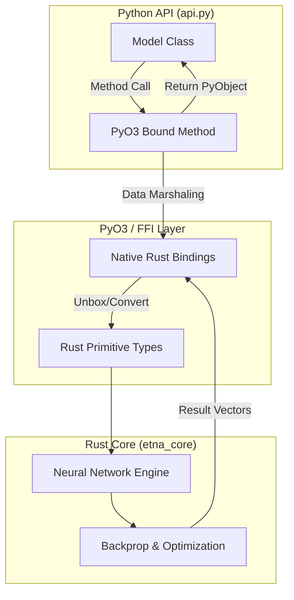
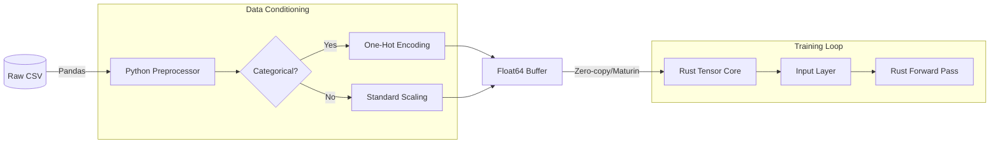
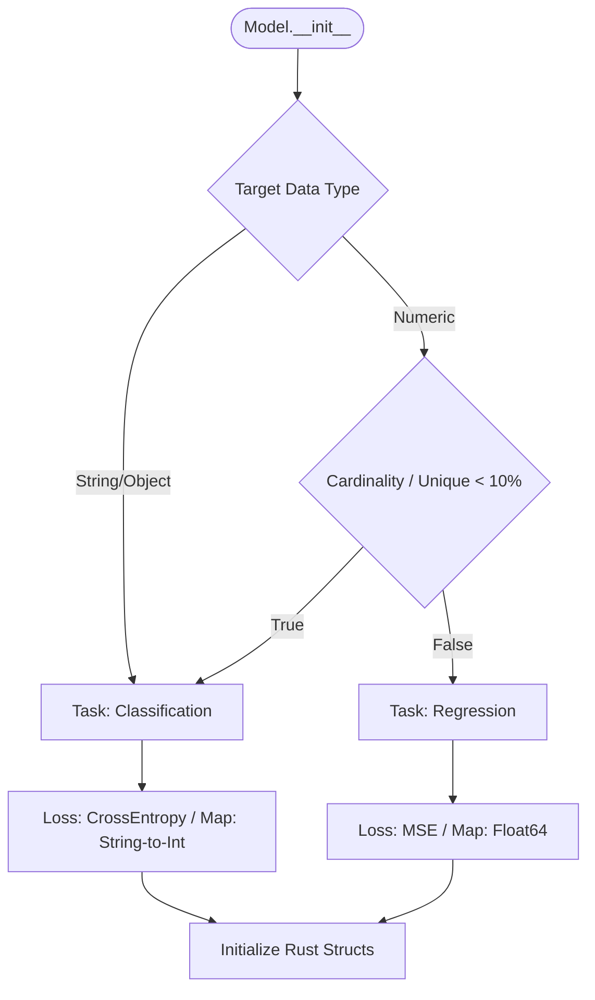

# etsi.etna
### High-Performance Neural Networks. Rust Core. Python Ease.

<div align="center">

[](LICENSE)
[](https://www.python.org/)
[](https://www.rust-lang.org/)
[](https://mlflow.org/)

</div>

---

## 🏗️ Technical Architecture

Etna operates as a hybrid system where the high-level orchestration is managed by Python, while the performance-critical computation is offloaded to a compiled Rust core.

### 1. The PyO3 Bridge
The following diagram illustrates the FFI (Foreign Function Interface) boundary. Python's `api.py` acts as a wrapper that invokes native Rust methods through PyO3 bindings.



### 2. Preprocessing Data Flow
Data follows a specific pipeline before reaching the training loop. Raw inputs are processed in Python using optimized Pandas/NumPy routines before being serialized into the Rust backend.


### 3. Smart Task Detection Logic
Etna's `__init__` branching logic automatically determines the mathematical objective (Classification vs. Regression) based on target variable heuristics.


---

## 🔧 Technical Troubleshooting
Building and linking Rust extensions requires a specific toolchain configuration.
* **Maturin Build Failures:** Ensure `pip install maturin` is updated to the latest version. If build fails on linkers, verify that the `target` directory has write permissions.
* **C++ Compiler Requirement (Windows):** Even though the core is Rust, PyO3 requires the MSVC linker. Ensure "Desktop development with C++" is installed via Visual Studio Installer.
* **Architecture Mismatches:** If using macOS Silicon, ensure both Python and Rust are targeting `aarch64-apple-darwin`.

---

## 🚀 Development Setup
**Build from Source**
```
# Clone and enter repo
git clone [https://github.com/etsi-ai/etna.git](https://github.com/etsi-ai/etna.git) && cd etna

# Build Rust extensions and install in dev mode
maturin develop --release
```
**Internal Metrics Tracking**
Etna utilizes MLflow to track Rust-calculated gradients and loss values. These are passed back across the bridge at the end of each epoch to minimize FFI overhead.

---

## 📄 License

This project is distributed under the **BSD-2-Clause License**. See the [LICENSE](LICENSE) file for complete details.

---

<div align="center">

**Built with ❤️ by the etsi.ai Team**

[⬆ Back to Top](#etsietna)

</div>
